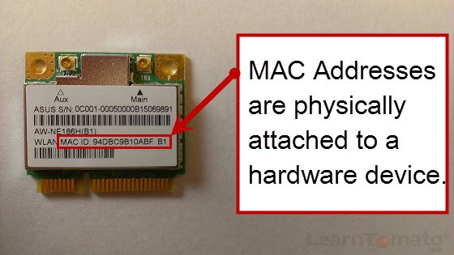
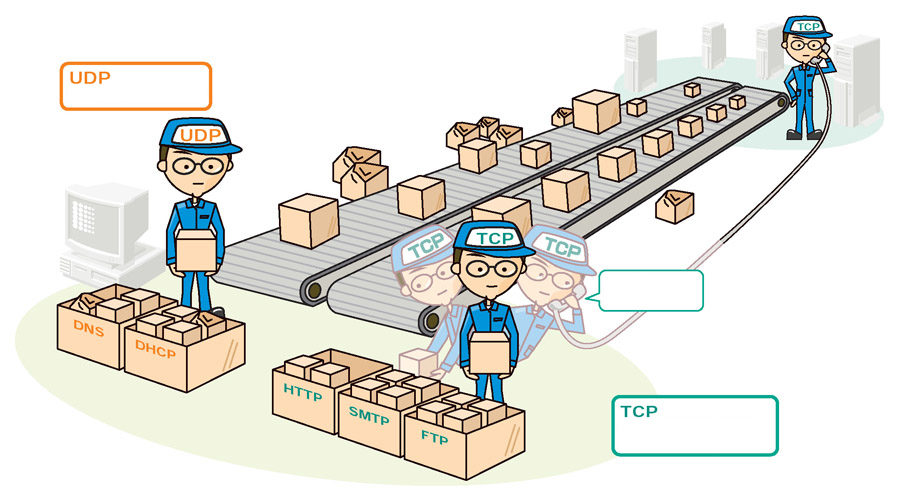

# 0x07. Networking Basics #0

## Overview

This project covers fundamental concepts in networking, including the OSI model, types of networks, MAC and IP addresses, TCP/UDP protocols, and network diagnostics using ICMP.

## Table of Contents

1. [OSI Model](#osi-model)
2. [Types of Network](#types-of-network)
3. [MAC and IP Address](#mac-and-ip-address)
4. [UDP and TCP](#udp-and-tcp)
5. [TCP and UDP Ports](#tcp-and-udp-ports)
6. [Is the Host on the Network](#is-the-host-on-the-network)

---

## OSI Model

The OSI (Open Systems Interconnection) model is an abstract framework that describes the communication functions of a telecommunication system. It consists of seven layers, from the lowest physical layer to the highest application-specific layer. In this project, we focus on the Transport layer (TCP/UDP) and the Network layer (IP and ICMP).

**Questions:**
1. What is the OSI model?
   - A. Set of specifications that network hardware manufacturers must respect
   - B. The OSI model is a conceptual model that characterizes the communication functions of a telecommunication system without regard to their underlying internal structure and technology
   - C. The OSI model is a model that characterizes the communication functions of a telecommunication system with a strong regard for their underlying internal structure and technology

2. How is the OSI model organized?
   - A. Alphabetically
   - B. From the lowest to the highest level
   - C. Randomly

**Repository:**
- GitHub: [alx-system_engineering-devops](https://github.com/alx-system_engineering-devops)
- Directory: [0x07-networking_basics](https://github.com/alx-system_engineering-devops/0x07-networking_basics)
- File: [0-OSI_model](https://github.com/alx-system_engineering-devops/0x07-networking_basics/blob/main/0-OSI_model)

---

## Types of Network

This section covers different types of networks, distinguishing between LAN (Local Area Network), WAN (Wide Area Network), and the Internet.

**Questions:**
1. What type of network is a computer in a local area connected to?
   - A. Internet
   - B. WAN
   - C. LAN

2. What type of network could connect offices in different buildings?
   - A. Internet
   - B. WAN
   - C. LAN

3. What network do you use when browsing www.google.com from your smartphone?
   - A. Internet
   - B. WAN
   - C. LAN

**Repository:**
- GitHub: [alx-system_engineering-devops](https://github.com/alx-system_engineering-devops)
- Directory: [0x07-networking_basics](https://github.com/alx-system_engineering-devops/0x07-networking_basics)
- File: [1-types_of_network](https://github.com/alx-system_engineering-devops/0x07-networking_basics/blob/main/1-types_of_network)

---

## MAC and IP Address

This section covers MAC (Media Access Control) and IP (Internet Protocol) addresses, highlighting their functions and distinctions.

**Questions:**
1. What is a MAC address?
   - A. The name of a network interface
   - B. The unique identifier of a network interface
   - C. A network interface

2. What is an IP address?
   - A. Is to devices connected to a network what postal address is to houses
   - B. The unique identifier of a network interface
   - C. Is a number that network devices use to connect to networks

**Repository:**
- GitHub: [alx-system_engineering-devops](https://github.com/alx-system_engineering-devops)
- Directory: [0x07-networking_basics](https://github.com/alx-system_engineering-devops/0x07-networking_basics)
- File: [2-MAC_and_IP_address](https://github.com/alx-system_engineering-devops/0x07-networking_basics/blob/main/2-MAC_and_IP_address)

---

## UDP and TCP

This section delves into the characteristics of UDP (User Datagram Protocol) and TCP (Transmission Control Protocol) and their roles in data transfer.

**Questions:**
1. Which statement is correct for the TCP box?
   - A. It is a protocol that is transferring data in a slow way but surely
   - B. It is a protocol that is transferring data in a fast way and might lose data along in the process

2. Which statement is correct for the UDP box?
   - A. It is a protocol that is transferring data in a slow way but surely
   - B. It is a protocol that is transferring data in a fast way and might lose data along in the process

**Repository:**
- GitHub: [alx-system_engineering-devops](https://github.com/alx-system_engineering-devops)
- Directory: [0x07-networking_basics](https://github.com/alx-system_engineering-devops/0x07-networking_basics)
- File: [3-UDP_and_TCP](https://github.com/alx-system_engineering-devops/0x07-networking_basics/blob/main/3-UDP_and_TCP)

---

## TCP and UDP Ports

This section explains the role of ports in TCP and UDP, emphasizing the importance of well-known ports. It includes a Bash script to display listening ports.

**Tasks:**
- Write a Bash script that displays listening ports.

**Repository:**
- GitHub: [alx-system_engineering-devops](https://github.com/alx-system_engineering-devops)
- Directory: [0x07-networking_basics](https://github.com/alx-system_engineering-devops/0x07-networking_basics)
- File: [4-TCP_and_UDP_ports](https://github.com/alx-system_engineering-devops/0x07-networking_basics/blob/main/4-TCP_and_UDP_ports)

---

## Is the Host on the Network

This section introduces a Bash script that uses ICMP to ping an IP address and determine if a network device is available.

**Tasks:**
- Write a Bash script that pings an IP address passed as an argument.

**Repository:**
- GitHub: [alx-system_engineering-devops](https://github.com/alx-system_engineering-devops)
- Directory: [0x07-networking_basics](https://github.com/alx-system_engineering-devops/0x07-networking_basics)
- File: [5-is_the_host_on_the_network](https://github.com/alx-system_engineering-devops/0x07-networking_basics/blob/main/5-is_the_host_on_the_network)

# Conclusion

In this project, we explored fundamental networking concepts, delving into the OSI model, types of networks, MAC and IP addresses, and the TCP/UDP protocols. Additionally, we examined the significance of TCP and UDP ports and learned how to diagnose network connectivity using ICMP.

Understanding the OSI model is crucial for comprehending the layered communication functions in a telecommunication system. We explored the Transport layer with a focus on TCP/UDP and the Network layer with IP and ICMP.

Differentiating between LAN, WAN, and the Internet provided insights into how networks connect locally and globally. The discussion on MAC and IP addresses clarified their roles as unique identifiers and network interface addresses.

The exploration of UDP and TCP shed light on the characteristics and differences between these two vital data transfer protocols. Additionally, we delved into the world of ports, emphasizing well-known ports and providing a Bash script to display listening ports.

The project concluded with a practical task involving ICMP, demonstrating how to ping an IP address to check the availability of a network device.

By completing these tasks, we gained a solid foundation in networking basics, preparing us for more advanced topics in the realm of system engineering and DevOps. The provided repository serves as a valuable resource for revisiting and reinforcing these concepts. Happy networking!
